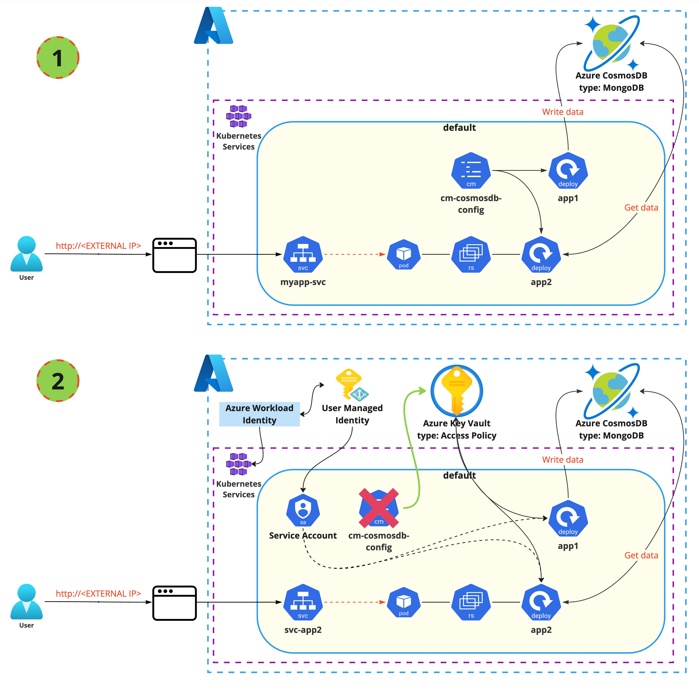

<br><br>
<br><br>
<br><br>

# Cosmos DB + Azure Key Vault + Azure Workload Identity

## Lab visualization:


# Configuration for visualization number 1

## Task 1: Create an instance of CosmosDB (type: MongoDB)

First we need to create Azure Key Vault service and store some sensitive information in it.

1. Login to Azure portal: `https://portal.azure.com`
2. Navigate to Cosmos DB service - from Marketplace or searching section from Azure portal
3. Search for **Azure Cosmos DB** service, click **Create**
4. Ensure you select the Azure Cosmos DB for MongoDB.
5. Choose **Request unit (RU) database account**
6. Fill the form:

    - **Resource group:** use your own resource group
    - **Account Name:** choose your CosmosDB name
    - **Location:** West Europe
    - **Capacity Mode:** Serverless

7. Go **Next** until last blade. Leave all fields by default. 
8. Click **Create** and wait for the deployment to finish. Be sure to actually click "Create" after validation succeeded.


## Task 2: Create a New Database and Collections in CosmosDB

1. Go to your new CosmosDB account.
2. Under the "Data Explorer" tab, click on New Collection
3. In the opened panel, select **Create new** next to the "Database id" dropdown.
4. Provide a name for your new database <COSMOS_DATABASE_NAME>.
5. In the same panel, you'll be prompted to enter details for the new collection (Collection id). Write there **UserCollection**
6. In the Shard key section write **city** 
7. Click **Create**

Create one more collection `ActivityCollection`:

8. Click again on New Collection
9.  In the opened panel, select **Use existing** and choose "Database id" you created in the fourth step.
10. In the same panel, you'll be prompted to enter details for the new collection (Collection id). Write there **ActivityCollection**
11. In the Shard key section write **user_email** 
12. Click **Create**

## Task 3: Prepare ConfigMap file and apply it to Kubernetes
1. Open `configmaps.yaml` and add information about Connection String to your CosmosDB and your CosmosDB name created in the previous task in point 4. Paste the name to the `configmaps.yaml`.
  
    You will find **CONNECTION_STRING** from the left Menu of your CosmosDB in the section **Connection strings**. Copy **PRIMARY CONNECTION STRING** and paste to the `configmaps.yaml`. 
2. Create a configmap named **cm-cosmosdb-config** 
    
    ```bash
    kubectl apply -f configmaps.yaml
    ```

## Task 4: Apply app1 to Kubernetes
1. Create a deployment named **app1**

    ```bash
    kubectl apply -f app1.yaml
    ```

2. Verify if the pod is in the status Running:
    
    ```bash
    kubectl get pods -l app=app1
    ```

## Task 5 Check if the application **app1** is writing the data to the CosmosDB
1. Go to your CosmosDB page and navigate to `Data Explorer`
2. Go to your database and choose `UserCollection` or `ActivityCollection`. Check if in the **Documents** are data in the format JSON (you have to click on the selected row of documents).

## Task 6: Apply app2 to Kubernetes
1. Create a deployment named **app2** and service (type: LoadBalancer)

    ```bash
    kubectl apply -f app2.yaml
    ```

2. Verify if the pod is in the status Running:
    
    ```bash
    kubectl get pods -l app=app2
    ```

3. Copy the exteranl IP of Service `svc-app2`

    ```bash
    kubectl get svc
    ```

4. Using any browser of your choice, navigate to **EXTERNAL-IP of svc-app2** address. The output should display information (in the tables) about last two users and activities added to CosmosDB by **app1**.

## Task 7: Delete resources created during this part of lab
1. Delete Kubernetes resources

    ```bash
    kubectl delete -f configmaps.yaml -f app1.yaml -f app2.yaml
    ```


# Configuration for visualization number 2
## Task 8: Create Azure Key Vault for stroing confgiuration instead of using ConfigMap
1. In Azure portal navigate to Azure Key Vault service - from Marketplace or searching section from Azure portal
2. Search for **Key Vault** service, click **Create**
3. Fill the form:

    - **Resource group:** use your own resource group
    - **Key vault name:** choose your name
    - **Region:** West Europe
    - **Pricing Tier:** Standard

4. Go to the section `Access configuration` and from Permission model choose **Vault access policy**.
5. Go **Next** until the last blade. Leave all fields by default.
6. Click **Create** and wait for the deployment to finish. Be sure to actually click "Create" after validation succeeded.

## Task 9: Create custom secrets in your Azure Key Vault
1. Open your Azure Key Vault service.
2. From the left pane select `Secrets`.
3. Click "Generate/Import" button
4. Create secrets required to connect to CosmosDB (keys and values from ConfigMaps):
   > **_NOTE:_**  Names of the secrets cannot contain (underscore symbol `_`). Make sure you set the same Secrets names like below:

    - Secret name: `CONNECTIONSTRING`, value: `<CONNECTION_STRING to CosmosDB>`
    - Secret name: `COSMOSDATABASENAME`, value: `<name of your CosmosDB serivce>`
    - Secret name: `USERCOLLECTIONNAME`, value: `UserCollection`
    - Secret name: `ACTIVITYCOLLECTIONNAME`, value: `ActivityCollection`

    While creating a secret leave all other fields with default values

## Task 10: Create User Managed Identity
1. In Azure portal navigate to Managed Identity service - from Marketplace or searching section from Azure portal
2. Search for **Managed Identity** service, click **Create**
3. Fill the form:

    - **Resource group:** use your own resource group
    - **Region:** West Europe
    - **Name:** name of your user managed indetity


4. Go **Next** until the last blade. Leave all fields by default.
5. Click **Create** and wait for the deployment to finish. Be sure to actually click "Create" after validation succeeded.

## Task 11: Add access policy to Key Vault for User Managed Identity
1. Go to your Azure Key Vault service.
2. Click **Access Policies** from left menu.
3. Click **Add access policy**
4. From **Secret permissions** section select checkbox next to **Get**
5. Click **Select principal** and in the search box enter your cluster's managed identity ID.
6. Select your identity and click on **Select** button. Apply settings by clicking on **Add** button.
7. Click on **Save** to persist your changes.

## Task 12: Update the AKS cluster with OIDC Issuer 
Azure Workload Identity need OIDC Issuer configured in the AKS cluster. With your AKS cluster, you can enable OpenID Connect (OIDC) Issuer, which allows Azure Active Directory (Azure AD) or other cloud provider identity and access management platform, to discover the API server's public signing keys. Thanks to that your pod can use workload identity to access secrets in Azure Key Vault.
1. Update AKS cluster:

    ```bash
    az aks update -g myResourceGroup -n myAKSCluster --enable-oidc-issuer
    ```

2. After success get the AKS cluster OIDC Issuer URL:

    ```bash
    az aks show --resource-group <Your Resource Group name> --name <Your AKS cluster name> --query "oidcIssuerProfile.issuerUrl" -o tsv
    ```

    Copy the output of the command, because it will be used in the next Task.

## Task 13 Create ServiceAccount object that will use user managed identity
1. Open `serviceaccount.yaml` and add there your Client ID of your User Managed Idnetity that you will find in the Overview page of your cretaed User Managed Identity.
2. Apply `serviceaccount.yaml` to your cluster:
       
    ```bash
    kubectl apply -f serviceaccount.yaml
    ```

## Task 14 Add Federeted Credentials to your User Managed Identity for usage of Azure Workload Identity
1. Go to created User Managed Idenity service and choose `Federated credentials` from left Menu.
2. Click **Add Credentials** button.
3. From the scenerio choose `Kubernetes accessing Azure resources`
4. Fill the form:

    - **Cluster Issuer URL:** <AKS cluster OIDC Issuer URL from Task 10 point 2>
    - **Namespace:** default
    - **Service Account:** sa-akv
    - **Name:** <Name for Federated Credentials>

5. Click Add


## Task 15: Install Azure CSI driver
Now we are going install and Azure CSI driver.

1. Create namespace for CSI

    ```bash
    kubectl create ns csi
    ```

1. Add Helm repo:
   
    ```bash
    helm repo add csi-secrets-store-provider-azure https://azure.github.io/secrets-store-csi-driver-provider-azure/charts
    ```

1. Install CSI driver:

    ```bash
    helm install my-csi-secrets-store-provider-azure csi-secrets-store-provider-azure/csi-secrets-store-provider-azure --version 1.4.0 -n csi --set secrets-store-csi-driver.syncSecret.enabled=true
    ```

1. Verify the driver was installed successfully. Enter:

    ```bash
    kubectl get pods -n csi
    ```

## Task 16: Configure Secrets Provider

Now we need to configure the Azure CSI driver. 

1. Edit the `secret_provider.yaml` file and set those values:

    - `clientID:`: `Client ID of your User Managed Idnetity`
    - `keyvaultName`: `NAME_OF_YOUR_KEY_VAULT`
    - `tenantId`: `YOUR_TENANT_ID` 

    `tenantId` can be read from Azure Portal (e.g.: from _Overview_ page of Azure Key Vault (field: `Directory ID`))

2. Apply the config: 

    ```bash
    kubectl apply -f secret_provider.yaml
    ```

## Task 17: Apply app1kv to Kubernetes
1. Create a deployment named **app1kv**

    ```bash
    kubectl apply -f app1_with_vault.yaml
    ```

2. Verify if the pod is in the status Running:
    
    ```bash
    kubectl get pods -l app=app1kv
    ```

## Task 18 Check if the application **app1kv** is writing the data to the CosmosDB
1. Go to your CosmosDB page and navigate to `Data Explorer`
2. Go to your database and choose `UserCollection` or `ActivityCollection`. Check if in the **Documents** are data in the format JSON (you have to click on the selected row of documents).

## Task 19: Apply app2kv to Kubernetes
1. Create a deployment named **app2kv** and service (type: LoadBalancer)

    ```bash
    kubectl apply -f app2_with_vault.yaml
    ```

2. Verify if the pod is in the status Running:
    
    ```bash
    kubectl get pods -l app=app2kv
    ```

3. Copy the exteranl IP of Service `svc-app2`

    ```bash
    kubectl get svc
    ```

4. Using any browser of your choice, navigate to **EXTERNAL-IP of svc-app2kv** address. The output should display information (in the tables) about last two users and activities added to CosmosDB by **app1kv**.


## Task 20: Delete resources created during this lab
1. Delete Kubernetes resources

    ```bash
    kubectl delete -f .
    ```


## END LAB

<br><br>

<center><p>&copy; 2023 Cloud Value Professional<p></center>
